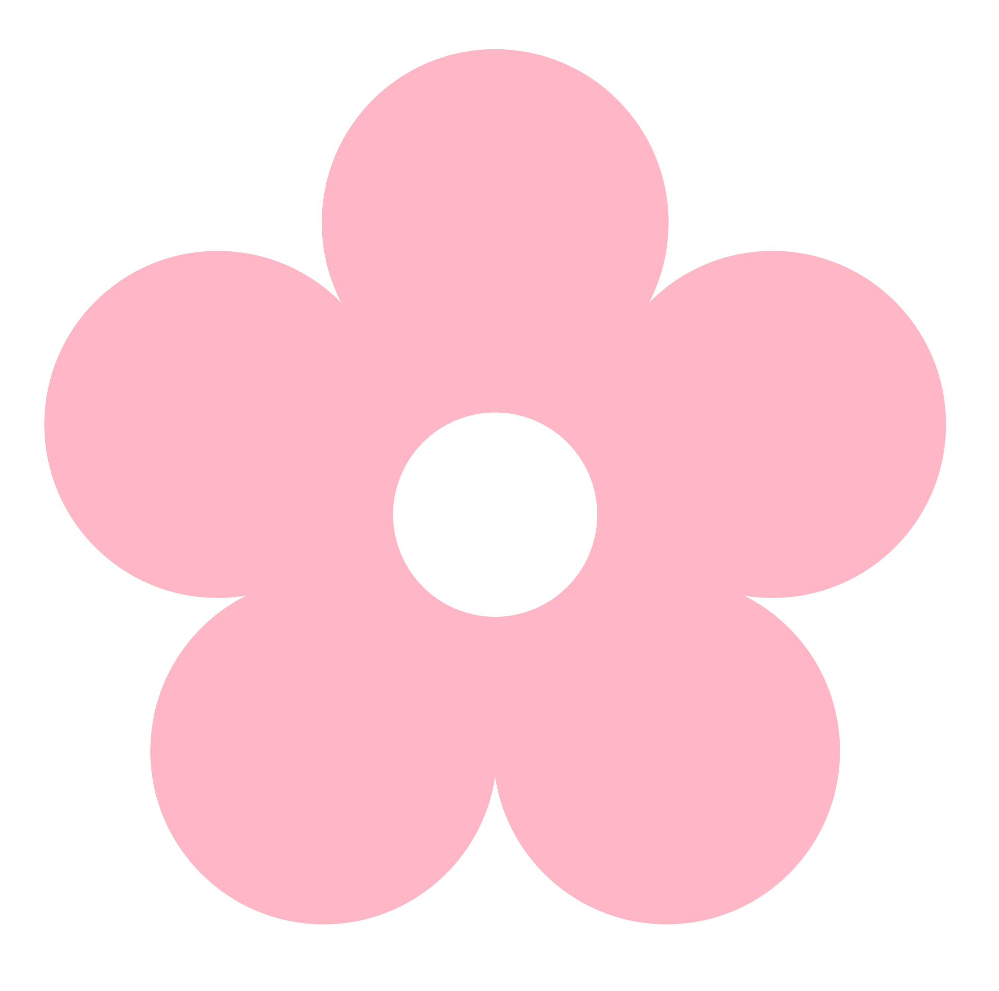
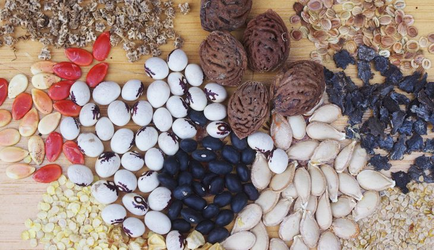

<h1>
SEED WARS
</h1>

---

<h2>
SOMMAIRE
</h2>

- Description du jeu
- Fonctionalités
- User Story
- Roadmap
- Poker Planning

---

<h2>
Description
</h2>

    Type de jeu : Tower Defense (Twist Action)

    

        

            <ul>
                <li>Arbre
                <li>Catapulte
                <li>Graine
                <li>Tourelle
                <li>Ennemis
            </ul>
        

    

    

        
    

---

    <h2>
        User Story
    </h2>
    <h5>
        (Sprint n°1)
    </h5>
    

        <ul class="col-l">
            <li class="red">
                Tordre l'arbre
            </li>
            <li class="red">
                Tirer sur des ennemis
            </li>
            <li class="red">
                Lancer une graine
            </li>
            <li class="red">
                Planter un arbre
            </li>
            <li class="ora">
                Tuer des ennemis
            </li>
        </ul>
        <ul class="col-r">
            <li class="gre">
                Lancer une partie
            </li>
            <li class="gre">
                Choisir une Graine
            </li>
            <li class="gre">
                Mettre en pause
            </li>
            <li class="gre">
                Reprendre le jeu
            </li>
            <li class="gre">
                Aller au menu
            </li>
        </ul>
    

    

        <legend>
            Degré d’importance => O : !!!!! O : !!!! O : !!! O : !! O : !
        </legend>
    

---

    <h2>
        Roadmap
    </h2>
    

---

    <h2>
        Poker Planning
    </h2>
    <table>
        <tbody>
            <tr>
                <td>Tirer sur un ennemi</td>
                <td>Tordre l'arbre</td>
                <td>Tuer un ennemi</td>
                <td>Lancer une partie</td>
                <td>Reprendre la partie</td>
            </tr>
            <tr>
                <td></td>
                <td>Lancer une graine</td>
                <td>Placer une tourelle</td>
                <td>Aller au menu</td>
                <td>Mettre pause</td>
            </tr>
            <tr>
                <td></td>
                <td></td>
                <td>Choisir une graine</td>
                <td></td>
                <td></td>
            </tr>
            <tr>
                <td>8pt</td>
                <td>5pt</td>
                <td>2pt</td>
                <td>1pt</td>
                <td>1/2pt</td>
            </tr>
        </tbody>
    </table>

---

### Tous droits réservés The Lab

